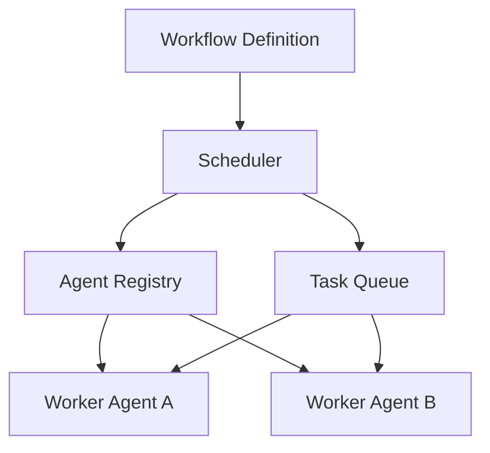

# AgentFlow


AgentFlow is a lightweight workflow engine for multi-agent systems.

It allows developers to define task graphs, register agents with capabilities, and execute workflows with dependency-aware scheduling.

## Why this exists

Most agent frameworks focus on prompts, tools, or messaging.

They do not provide a clear execution model for:

- task dependencies
- workflow scheduling
- agent capability matching
- execution order tracing

AgentFlow explores that missing layer.

## Quick Start

```bash
git clone https://github.com/joshuamlamerton/agentflow
cd agentflow
python examples/demo.py
```

## Demo

The demo shows:

- a workflow with dependent tasks
- two agents with different capabilities
- a scheduler assigning tasks in dependency order
- an execution trace printed to the console

## Architecture



## Repository Structure

```text
agentflow

README.md
LICENSE

docs
  architecture.md

core
  workflow.py
  agent.py
  scheduler.py

examples
  demo.py

tests
  test_basic.py
```

## Roadmap

Phase 1  
Basic workflow and dependency execution

Phase 2  
DAG visualization and trace export

Phase 3  
Distributed task routing

Phase 4  
Framework integrations

## License

Apache 2.0
