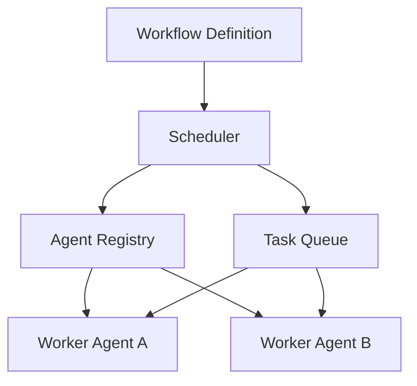

# AgentFlow
================

[](LICENSE)
[](https://www.python.org/)
[]()

## Overview
-----------

AgentFlow is a lightweight workflow engine designed for multi-agent systems. It enables developers to define task graphs, register agents with capabilities, and execute workflows with dependency-aware scheduling.

## Problem Statement
-------------------

Most existing agent frameworks focus on prompts, tools, or messaging, but they lack a clear execution model for:

* Task dependencies
* Workflow scheduling
* Agent capability matching
* Execution order tracing

AgentFlow addresses this gap by providing a comprehensive solution for executing complex workflows in multi-agent systems.

## Key Features
--------------

* **Task Graphs**: Define workflows as directed acyclic graphs (DAGs) with dependent tasks.
* **Agent Capabilities**: Register agents with specific capabilities and match them with tasks.
* **Dependency-Aware Scheduling**: Schedule tasks based on their dependencies and execute them in the correct order.
* **Execution Tracing**: Print an execution trace to the console for debugging and monitoring purposes.

## Quick Start
--------------

Get started with AgentFlow by following these steps:

```bash
git clone https://github.com/joshuamlamerton/agentflow
cd agentflow
python examples/demo.py
```

## Demo
------

The demo showcases the following features:

* A workflow with dependent tasks
* Two agents with different capabilities
* A scheduler assigning tasks in dependency order
* An execution trace printed to the console

## Architecture
--------------

The following diagram illustrates the high-level architecture of AgentFlow:



## Repository Structure
-----------------------

The AgentFlow repository is organized as follows:

```text
agentflow

README.md
LICENSE

docs
  architecture.md

core
  workflow.py
  agent.py
  scheduler.py

examples
  demo.py

tests
  test_basic.py
```

## Roadmap
---------

AgentFlow is currently in the experimental phase. The roadmap consists of the following phases:

### Phase 1: Basic Workflow and Dependency Execution

* Implement basic workflow and dependency execution
* Develop a scheduler that assigns tasks based on their dependencies

### Phase 2: DAG Visualization and Trace Export

* Implement DAG visualization for debugging and monitoring purposes
* Export execution traces in a human-readable format

### Phase 3: Distributed Task Routing

* Develop a distributed task routing system for large-scale workflows
* Implement load balancing and task distribution across multiple agents

### Phase 4: Framework Integrations

* Integrate AgentFlow with popular frameworks and libraries
* Develop a plugin architecture for easy extension and customization

## License
-------

AgentFlow is licensed under the Apache 2.0 license.